Análisis y Visualizacián de la red de autobuses de Granada
============

---
Author:
- Pablo Leo Muñoz | pabloleo@correo.ugr.es
---

Introducción
============

Durante este trabajo, se realizará el estudio de la red de autobuses de Granada, donde cada nodo se corresponde con una marquesina (parada de bus) y un arco se corresponde con el paso de una o más lineas de autobuses entre ambas paradas.

Los datos han sido obtenidos de la página web de movilidad de Granada [1], la cuál posee dos archivos **.kml** con las paradas de bus y las líneas de bus. Mediante el uso de un script de Python, tanto los nodos como los arcos han sido exportados a otro formato más legible (**.csv**).

Para conseguir que las lineas de buses se exportasen de forma correcta (que las lineas estuvieran conectadas de forma correcta), se han ordenado los arcos utilizando para ello la distancia euclídea de las coordenadas de las lineas de autobús a cada una de las paradas.

El plano original de la red de autobuses ha sido obtenido de la página web de información sobre el turismo y transporte de Granada [2].

    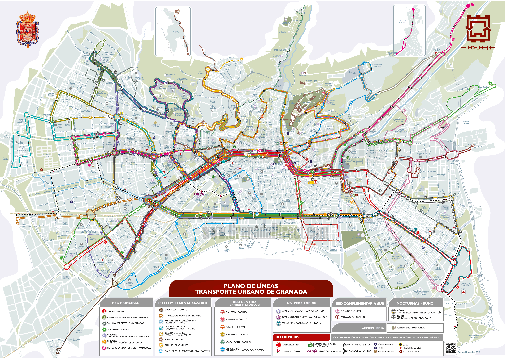

Actualmente, en la ciudad de Granada existen un total de **29 lineas**, incluyendo las lineas nocturnas (servicio búho).

Análisis básico de la red
=========================

Tras cargar el conjunto de datos en **Gephi**, se ha utilizado *Force Atlas 2* como *Layout* para visualizar la red evitando solapamientos.

    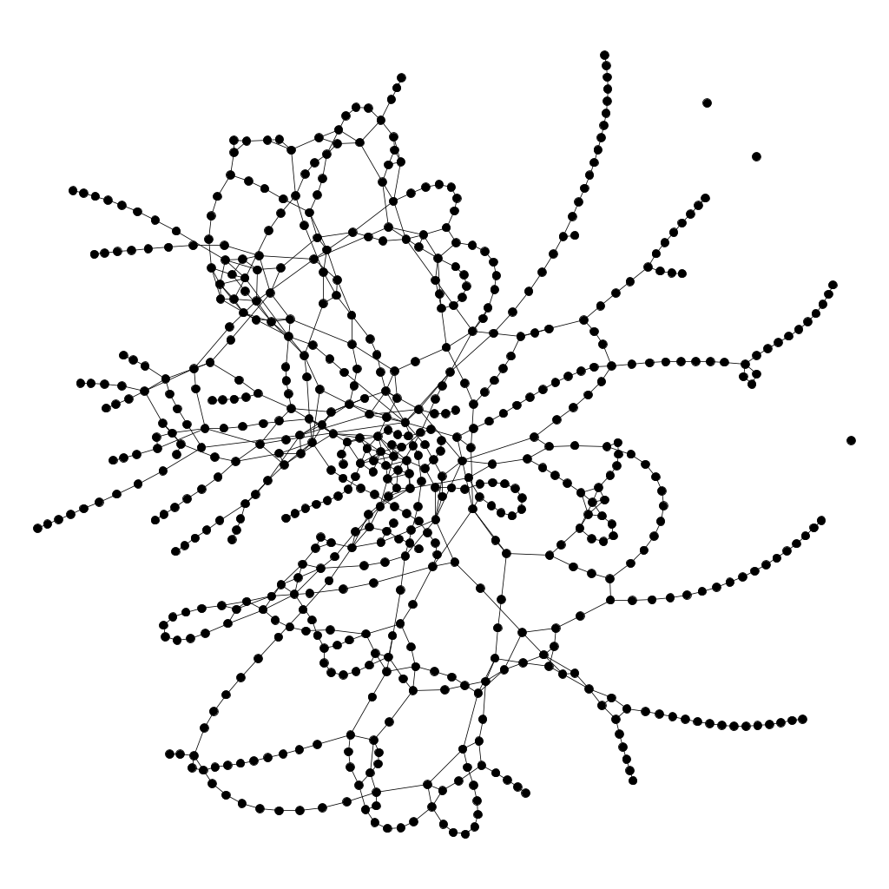

Ya que se trata de una red de autobuses, se han exportado también las coordenadas de las paradas de autobuses, y mediante el uso del plugin **Geo Layout**, se ha generado otra visualización más orientativa de los datos.

    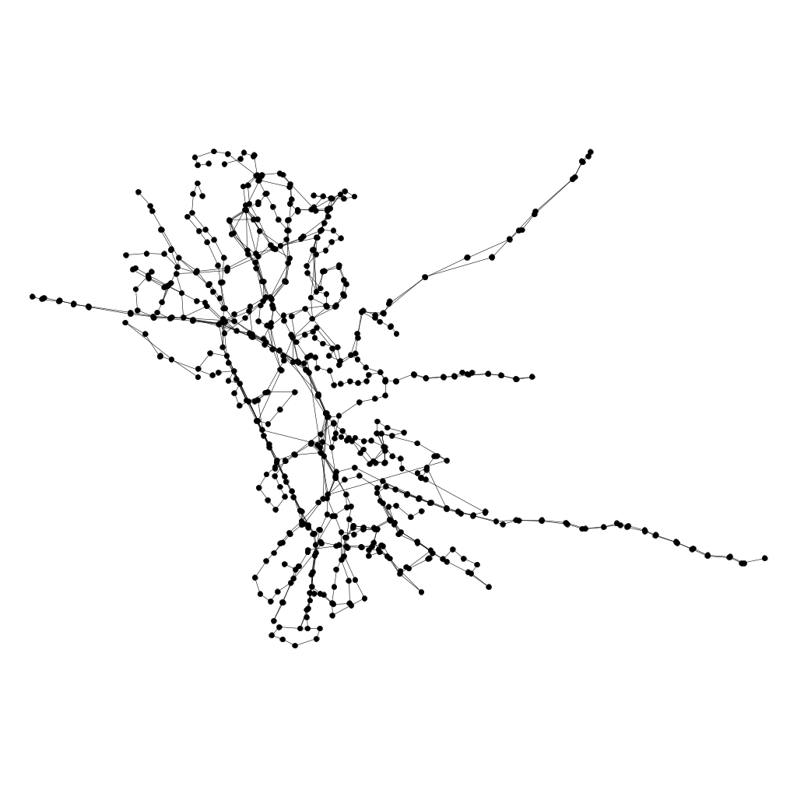

El conjunto de datos posee un total de **624** nodos (N) y **829** arcos (L). Este conjunto de datos ha sido generado de manera que no existen arcos repetidos, además de no poseer dirección, para simplificar el problema.

-   En lo referido al **número máximo de enlaces** Lmax, este viene determinado por:

    Lmax = N(N-1)/2

    Donde *N* es el número de nodos. Para este caso en concreto, el número máximo de enlaces es de **194376** arcos.

-   Centrándonos en el **grado medio** de la red &lsaquo; k &rsaquo;, este viene determinado por:

    &lsaquo; k &rsaquo; = 2L/N

    Donde *N* es el número de nodos y *L* es el número de arcos de la red. Para este caso en concreto, el grado medio es **2.657**.

-   Fijándonos en la **densidad** de la red *D*, esta viene determinada por:

    D = L/Lmax

    Donde *L* es el número de arcos y  *Lmax* es el número máximo de enlaces. Para este caso en concreto, la densidad de la red es **0.004**.

-   Siguiendo con el **coeficiente medio de clustering** &lsaquo; C &rsaquo;, este viene determinado por:

    &lsaquo; C &rsaquo; = 1/N &Sigma;i=1N Ci

    Donde *N* es el número de nodos y *Ci* es el coeficiente de clustering del nodo *i*. Para este caso en concreto, el coeficiente medio de clustering es de **0.063**.

-   Centrándonos en las **componentes conexas** de la red, se puedede observar que existen 4 componentes conexas, de las cuales 1 es la componente 'gigante'. Tras filtrar la componente gigante del resto, se ha obtenido que existen un total de **621** nodos (99.52% del original) y **829** arcos (100% del original).

-   En lo referido a las medidas de **centralidad** de la red, se observa que el **diámetro** de la red dmax es de **47**, además de tener un **radio** de **24** y una **distancia media** &lsaquo; d &rsaquo; de **13.675**.

A partir de las medidas calculadas anteriormente, se puede realizar el siguiente análisis de la red estudiada:\
**Valores de las medidas**: N = 624 nodos, L = 829 enlaces, D = 0.004\
**Grado medio**: &lsaquo; k &rsaquo; = 2.657 &rarr; cada parada está unida de media a otras 2-3 paradas. Lo cual tiene sentido, pues una línea une (exceptuando la primera y la última parada) cada parada con la anterior y la siguiente.\
Además, la distribución de grados nos confirma que existen muy pocos nodos que no tienen ninguna conexión ($\approx 3$ no pertenecen a la componente gigante), algunos que tienen una única conexión (&asymp; 30 son las primeras y últimas paradas de cada línea) y la gran mayoría tienen 2 conexiones. También se puede observar que un &asymp; 75% de los nodos tienen un grado menor a 4.

    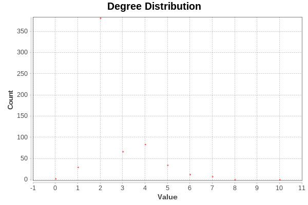

Existen también varios nodos fuertemente conectados (posiblemente hubs), de los cuales el mayor posee un grado de 10. A pesar de ello, no se puede decir que se de la propiedad **libre de escala**, pues la diferencia respecto al grado medio no es lo suficientemente grande para que se pueda considerar que existe esta propiedad.

**Diámetro**: dmax = 47. Esta medida indica que el número de nodos entre las paradas más alejadas es grande, hecho que se confirma fijándonos en la distancia media &lsaquo; d &rsaquo; = 13.675. Esto se puede deber a que una red de autobuses está pensada para unir cualquier punto de la ciudad, pero no necesariamente en el menor número de paradas.

**Conectividad**: la red presenta 4 componentes conexas, de las cuales 3 de ellas están formadas por un solo nodo aislado que no se encuentran en ninguna línea.\
Vemos que existe una componente gigante que agrupa el 99.52% de los nodos (621/624).

**Coeficiente de clustering medio**: &lsaquo; C &rsaquo; = 0.063. Este valor es bastante bajo, ya que la función de las redes de transporte no es conectar directamente cualquier parada con el resto (lo que generaría un alto coeficiente de clustering), si no generar un camino que una cualquier par de paradas de forma **no** directa.

    

El coeficiente de clustering es mucho mayor en las paradas poco conectadas que en las paradas etiquetadas como *hubs*, ya que las paradas con un grado bajo están situadas en vecindarios localmente densos mientras que las paradas con un grado alto están situadas en vecindarios localmente poco densos.

Estudio de la centralidad de los actores
========================================

Durante esta sección, se estudiarán los 5 actores que de acuerdo con diversas mediads de **grado**, **intermediación**, **cercanía** y **vector propio** se consideran como los principales.

|                    **Grado**                    |                   **Intermediación**                   |                      **Cercanía**                     |                   **Vector propio**                  |
|:-------------------------------------------:|:--------------------------------------------------:|:-------------------------------------------------:|:------------------------------------------------:|
|       Avda. Constitución 2 Triunfo   **10**      |            Gran Vía 5 Catedral   **0.40635**            |            Gran Vía 5 Catedral   **0.12372**           |         Avda. Constitución 2 Triunfo   **1.0**        |
|        Cno. Ronda 130 Méndez Núñez   **8**       |               Constitución 7   **0.30835**              |              Constitución 7   **0.12330**              |       Cno. Ronda 130 Méndez Núñez   **0.88731**       |
| Acera del Darro 1 Fuente de las Batallas   **7** |  Acera del Darro 1 Fuente de las Batallas   **0.28917** | Acera del Darro 1 Fuente de las Batallas   **0.11980** |              Cno. Ronda 148   **0.85517**             |
|           Avda. Constitución 21   **7**          |              Plaza San Isidro   **0.21179**             |        Avda. del Hospicio Triunfo   **0.11895**        |          Avda. Constitución 20   **0.78249**          |
|  Avda. Constitución 50 Caleta - Hospital   **7** | Acera del Darro 30 Fuente de las Batallas   **0.18381** |       Avda. Constitución 2 Triunfo   **0.11893**       | Avda. Constitución 50 Caleta - Hospital   **0.77971** |

-   Fijándonos en el **grado**, observamos que el nodo (parada de bus) que más conectado está a otras paradas es 'Avda. Constitución 2 - Triunfo', seguido de 'Cno. Ronda 130 - Méndez Núñez' y 'Acera del Darro 1 - Fuente de las Batallas'. Estas tres paradas pueden ser consideradas como las más importantes respecto a los vecinos más cercanos.

-   Por su parte, en cuanto a la **intermediación**, observamos que el nodo que más valor de correduría tiene es 'Gran Vía 5 - Catedral', seguido de 'Constitución 7' y 'Acera del Darro 1 - Fuente de las Batallas'. Estas tres paradas pueden ser consideradas como las más importantes respecto al número de caminos geodésicos que pasan por ellos (el número de caminos mínimos que pasan por estos nodos para unir dos paradas).

-   En cuanto a la **cercanía**, observamos que el nodo más central de la red es 'Gran Vía 5 - Catedral', seguido de 'Constitución 7' y 'Acera del Darro 1 - Fuente de las Batallas'. Estas tres paradas pueden ser consideradas como las más cercanas a cualquier actor de la red respecto a las distancia geodésica (son las paradas que de media tienen menos 'saltos' a todas las paradas de la red).

-   Finalmente, la centralidad de **vector propio** muestra que la parada más importante respecto a la centralidad de sus vecinos es 'Avda. Constitución 2 - Triunfo', seguido de 'Cno. Ronda 130 - Méndez Núñez' y 'Cno. Ronda 148'. Estas tres paradas pueden ser consideradas como las más importantes de acuerdo a la prominencia de sus vecinos.

Detección de comunidades
========================

Durante esta sección, se aplicarán métodos de detección de comunidades sobre la red para determinar que estructura posee. Para ello se utilizará el método de **Lovaina**.

-   Resolución **0.5**: Se han encontrado un total de 32 comunidades con un valor de modularidad *Q* de **0.828**.
-   Resolución **0.75**: Se han encontrado un total de 24 comunidades con un valor de modularidad *Q* de **0.838**.
-   Resolución **1.0**: Se han encontrado un total de 21 comunidades con un valor de modularidad *Q* de **0.837**.
-   Resolución **2.5**: Se han encontrado un total de 13 comunidades con un valor de modularidad *Q* de **0.820**.
-   Resolución **5.0**: Se han encontrado un total de 6 comunidades con un valor de modularidad *Q* de **0.711**.

A partir de los resultados anteriores, se puede concluir que la resolución de **0.75**, seguido de la resolución de **1.0** fueron los que obtuvieron unos valores de modularidad más altos. Esto significa que en la red pueden existir alrededor de
24/21 comunidades, lo que parece corresponder con el número de lineas existentes en la red de buses. Para comprobarlo, se generarán dos gráficas con las comunidadesd detectadas por ambas resoluciones.

    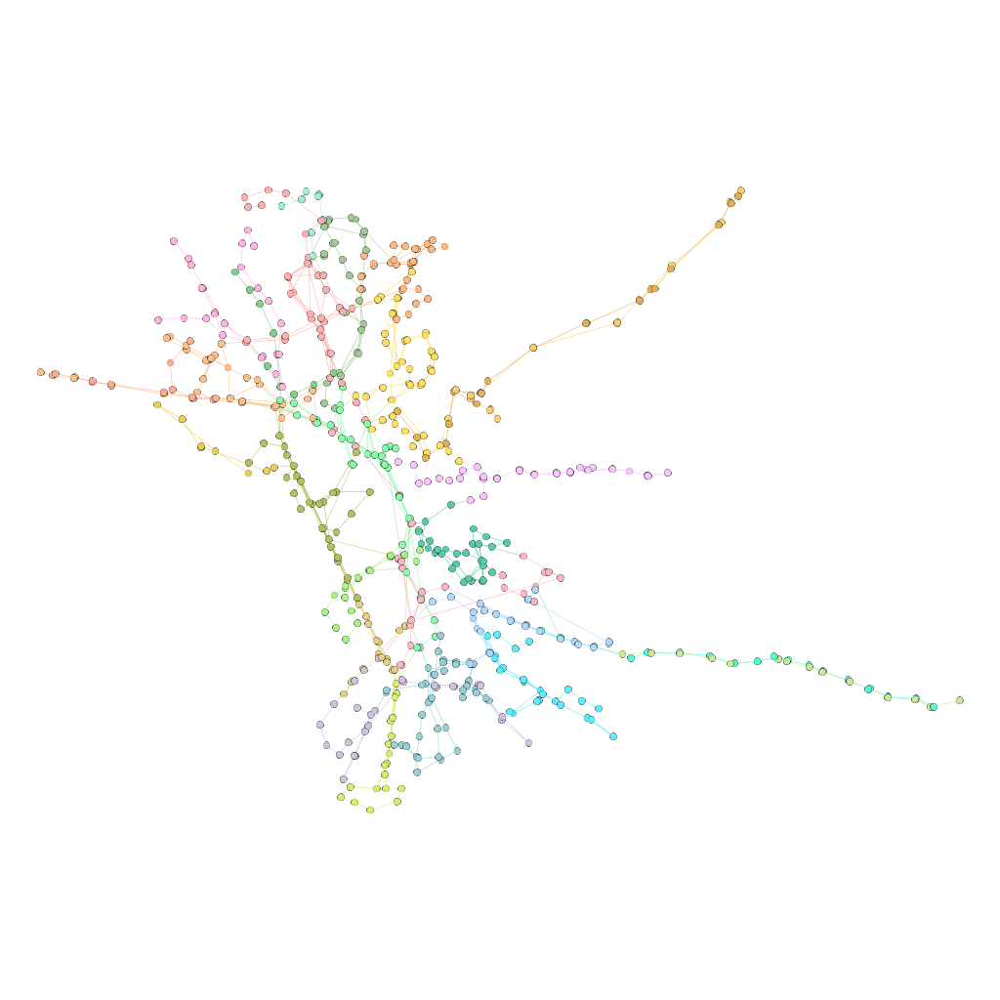
    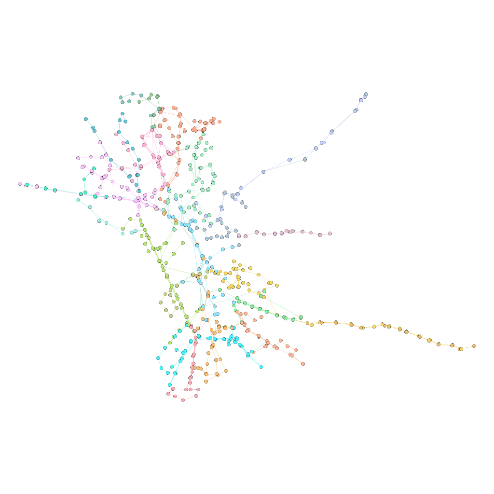

    
En las gráficas con la modularidad de 0.75 y de 1.0 (izquierda y derecha respectivamente), se puede observar como las comunidades detectadas parecen corresponder con las lineas de buses existentes.

Visualizaciones y gráficos adicionales
======================================

Una vez estudiados los actores más centrales, se han generado diversas gráficas que muestran la relacción entre estas medidas de centralidad. En las siguientes figuras, se pueden observar distintas gráficas, en las cuales el tamaño de los nodos corresponde con la intermediación de los nodos y su color depende de otras medidas como la centralidad del vector propio, la cercanía o el
grado.

    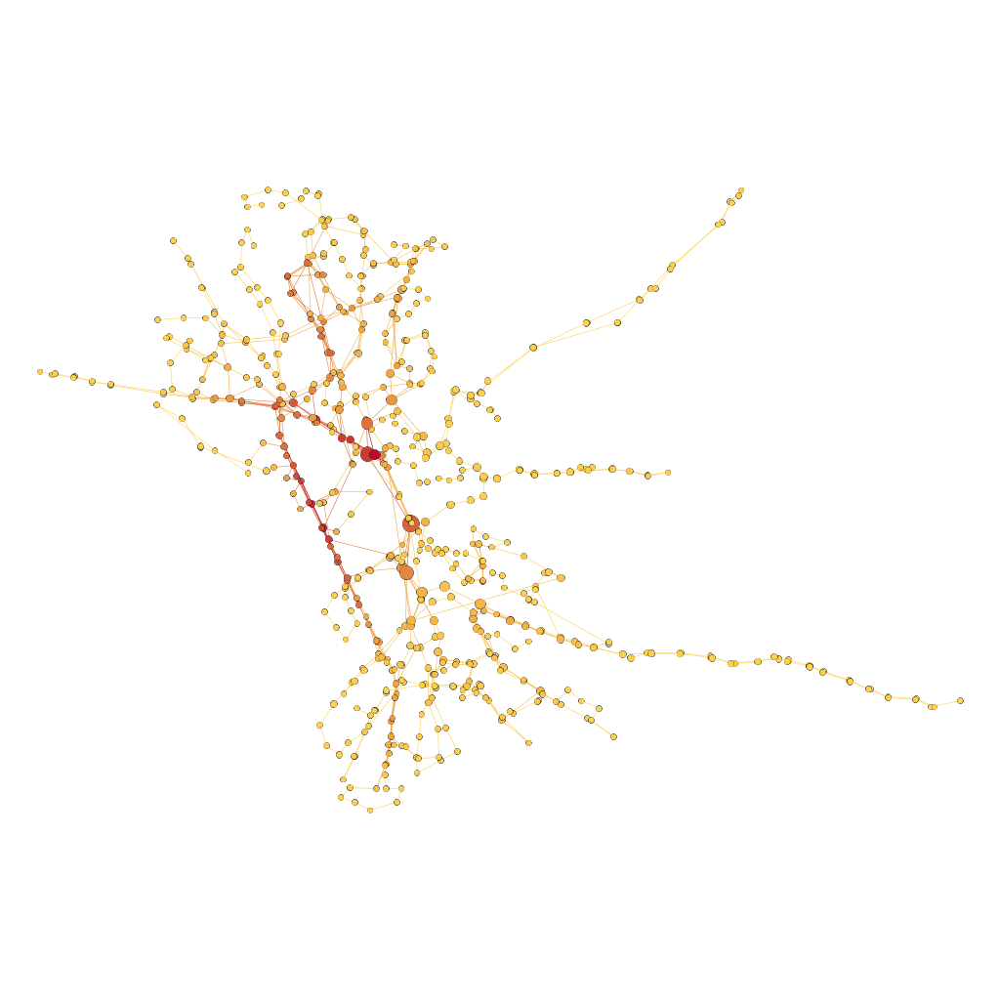

    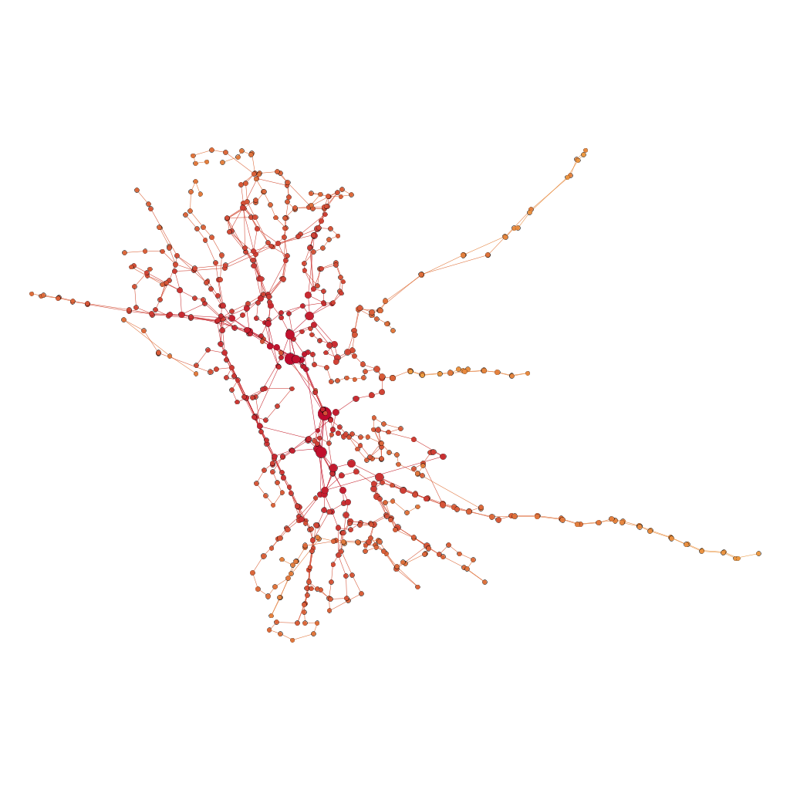

    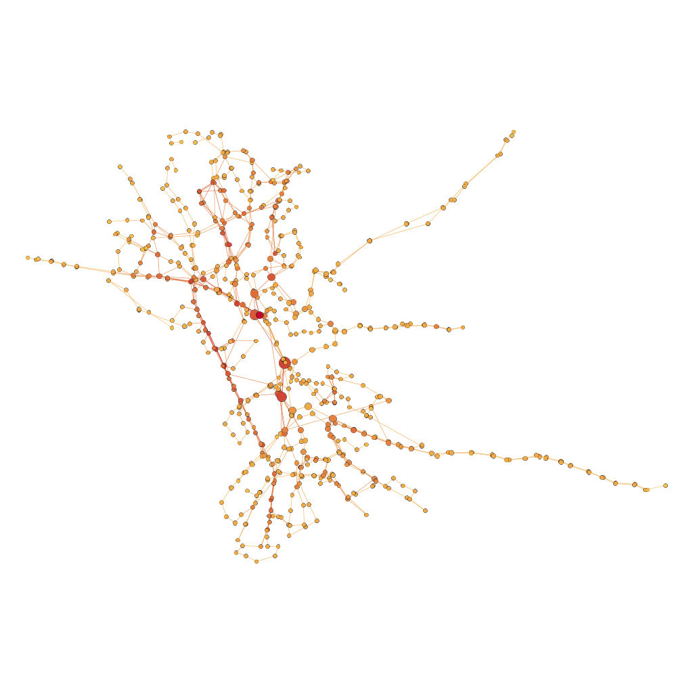

Por otro lado, en las siguientes figuras, se puede observar cómo se relacionan las medidas de centralidad del vector propio y grado con la intermediación.

    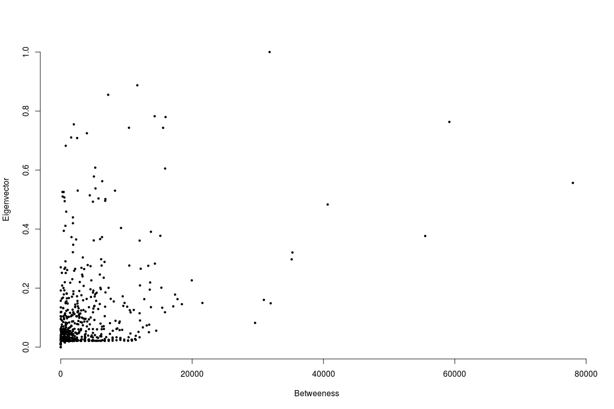

    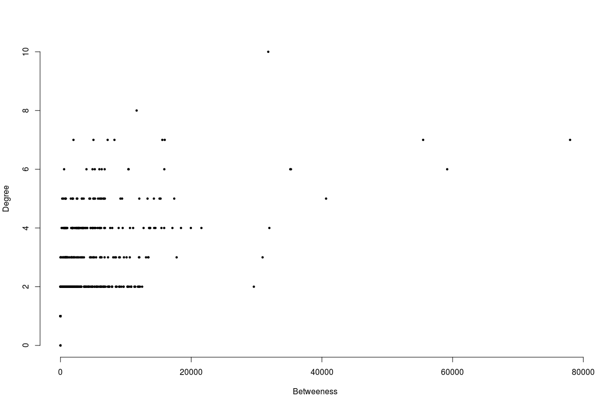

[1]: http://www.movilidadgranada.com/autobuses.php

[2]: http://www.granadadirect.com/transporte/lineas-autobuses-granada/
