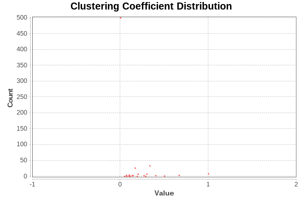

Análisis y Visualizacián básica de una red social con *Gephi*
============

---
Author:
- Pablo Leo Muñoz | pabloleo@correo.ugr.es
---

Introducción
============

Durante este trabajo, se realizará el estudio de la red de autobuses de
Granada, donde cada nodo se corresponde con una marquesina (parada de
bus) y un arco se corresponde con el paso de una o más lineas de
autobuses entre ambas paradas.

Los datos han sido obtenidos de la página web de movilidad de Granada
[1], la cuál posee dos archivos **.kml** con las paradas de bus y las
líneas de bus. Mediante el uso de un script de Python, tanto los nodos
como los arcos han sido exportados a otro formato más legible
(**.csv**).

Cabe destacar que para conseguir que las lineas de buses se exportasen
de forma correcta (que las lineas estuvieran conectadas de forma
correcta), se han ordenado los arcos utilizando para ello la distancia
euclídea de las coordenadas de las lineas de autobús a cada una de las
paradas.

El plano original de la red de autobuses se puede observar en la figura
\[fig:plano.buses\], el cuál ha sido obtenido de la página web de
información sobre el turismo y transporte de Granada [2].

Actualmente, en la ciudad de Granada existen un total de 29 lineas,
incluyendo las lineas nocturnas (servicio búho).

Análisis básico de la red
=========================

Tras cargar el conjunto de datos en **Gephi**, se ha utilizado *Force
Atlas 2* como *Layout* para visualizar la red evitando solapamientos. La
red resultante se puede obseravar en la figura \[fig:forceatlas2\].

Ya que se trata de una red de autobuses, se han exportado también las
coordenadas de las paradas de autobuses, y mediante el uso del plugin
**Geo Layout**, se ha generado otra visualización más orientativa de los
datos, la cual se puede observar en la figura \[fig:geolayout\].

El conjunto de datos posee un total de **624** nodos (N) y **829** arcos
(L). Este conjunto de datos ha sido generado de manera que no existen
arcos repetidos, además de no poseer dirección, para simplificar el
problema.

-   En lo referido al **número máximo de enlaces** $L_{max}$, este viene
    determinado por:

    $$L_{max} = \frac{N(N-1)}{2}$$

    Donde $N$ es el número de nodos. Para este caso en concreto, el
    número máximo de enlaces es de **194376** arcos.

-   Centrándonos en el **grado medio** de la red $\langle k \rangle$,
    este viene determinado por:

    $$\langle k \rangle = \frac{2L}{N}$$

    Donde $N$ es el número de nodos y $L$ es el número de arcos de la
    red. Para este caso en concreto, el grado medio es **2.657**.

-   Fijándonos en la **densidad** de la red $D$, esta viene determinada
    por:

    $$D = \frac{L}{L_{max}}$$

    Donde $L$ es el número de arcos y $L_{max}$ es el número máximo de
    enlaces. Para este caso en concreto, la densidad de la red es
    **0.004**.

-   Siguiendo con el **coeficiente medio de clustering**
    $\langle C \rangle$, este viene determinado por:

    $$\langle C \rangle = \frac{1}{N} \sum_{i=1}^{N} C_{i}$$

    Donde $N$ es el número de nodos y $C_{i}$ es el coeficiente de
    clustering del nodo $i$. Para este caso en concreto, el coeficiente
    medio de clustering es de **0.063**.

-   Centrándonos en las **componentes conexas** de la red, se puedede
    observar que existen 4 componentes conexas, de las cuales 1 es la
    componente ‘gigante’. Tras filtrar la componente gigante del resto,
    se ha obtenido que existen un total de **621** nodos (99.52% del
    original) y **829** arcos (100% del original).

-   En lo referido a las medidas de **centralidad** de la red, se
    observa que el **diámetro** de la red $d_{max}$ es de **47**, además
    de tener un **radio** de **24** y una **distancia media**
    $\langle d \rangle$ de **13.675**.

A partir de las medidas calculadas anteriormente, se puede realizar el
siguiente análisis de la red estudiada:\
**Valores de las medidas**: $N=624$ nodos, $L=829$ enlaces, $D=0.004$\
**Grado medio**: $\langle k \rangle = 2.657$ $\rightarrow$ cada parada
está unida de media a otras 2-3 paradas. Lo cual tiene sentido, pues una
línea une (exceptuando la primera y la última parada) cada parada con la
anterior y la siguiente.\
Además, la distribución de grados nos confirma que existen muy pocos
nodos que no tienen ninguna conexión ($\approx 3$ no pertenecen a la
componente gigante), algunos que tienen una única conexión ($\approx 30$
son las primeras y últimas paradas de cada línea) y la gran mayoría
tienen 2 conexiones. También se puede observar que un $\approx 75\%$ de
los nodos tienen un grado menor a 4.

    

Existen también varios nodos fuertemente conectados (hubs), de los
cuales el mayor posee un grado de 10. Se da la propiedad **libre de
escala**.

**Diámetro**: $d_{max} = 47$. Esta medida indica que a pesar de la
existencia de *hubs*, el número de nodos entre las paradas más alejadas
es grande, hecho que se confirma fijándonos en la distancia media
$\langle d \rangle = 13.675 $. Esto se puede deber a que una red de
autobuses está pensada para unir cualquier punto de la ciudad, pero no
necesariamente en el menor número de paradas.

**Conectividad**: la red presenta 4 componentes conexas, de las cuales 3
de ellas están formadas por un solo nodo aislado que no se encuentran en
ninguna línea.\
Vemos que existe una componente gigante que agrupa el $99.52\%$ de los
nodos (621/624).

**Coeficiente de clustering medio**: $\langle C \rangle = 0.063$. Es
bastante bajo, ya que la función de las redes de transporte no es
conectar directamente cualquier parada con el resto (lo que generaría un
alto coeficiente de clustering), si no generar un camino que una
cualquier par de paradas de forma **no** directa.

    

El coeficiente de clustering es mucho mayor en las paradas poco
conectadas que en los *hubs*, ya que las paradas con un grado bajo están
situadas en vecindarios localmente densos mientras que las paradas con
un grado alto están situadas en vecindarios localmente poco densos.

Estudio de la centralidad de los actores
========================================

Durante esta sección, se estudiarán los 5 actores que de acuerdo con
diversas mediads de **grado**, **intermediación**, **cercanía** y
**vector propio** son consideradas como los principales.

-   Fijándonos en el **grado**, observamos que el nodo (parada de bus)
    que más conectado está a otras paradas es ‘Avda. Constitución 2 -
    Triunfo’, seguido de ‘Cno. Ronda 130 - Méndez Núñez’ y ‘Acera del
    Darro 1 - Fuente de las Batallas’. Estas tres paradas pueden ser
    consideradas como las más importantes respecto a los vecinos más
    cercanos.

-   Por su parte, en cuanto a la **intermediación**, observamos que el
    nodo que más valor de correduría tiene es ‘Gran Vía 5 - Catedral’,
    seguido de ‘Constitución 7’ y ‘Acera del Darro 1 - Fuente de las
    Batallas’. Estas tres paradas pueden ser consideradas como las más
    importantes respecto al número de caminos geodésicos que pasan por
    ellos.

-   En cuanto a la **cercanía**, observamos que el nodo más central de
    la red es ‘Gran Vía 5 - Catedral’, seguido de ‘Constitución 7’ y
    ‘Acera del Darro 1 - Fuente de las Batallas’. Estas tres paradas
    pueden ser consideradas como las más cercanas a cualquier actor de
    la red respecto a las distancia geodésica.

-   Finalmente, la centralidad de **vector propio** muestra que la
    parada más importante respecto a la centralidad de sus vecinos es
    ‘Avda. Constitución 2 - Triunfo’, seguido de ‘Cno. Ronda 130 -
    Méndez Núñez’ y ‘Cno. Ronda 148’. Estas tres paradas pueden ser
    consideradas como las más importantes de acuerdo a la prominencia de
    sus vecinos.

Detección de comunidades
========================

Durante esta sección, se aplicarán métodos de detección de comunidades
sobre la red para determinar que estructura posee. Para ello se
utilizará el método de **Lovaina**.

-   Resolución **0.5**: Se han encontrado un total de 32 comunidades con
    un valor de modularidad $Q$ de 0.828.

    \[fig:modularity.05\]

-   Resolución **0.75**: Se han encontrado un total de 24 comunidades
    con un valor de modularidad $Q$ de 0.838.

    \[fig:modularity.75\]

-   Resolución **1.0**: Se han encontrado un total de 21 comunidades con
    un valor de modularidad $Q$ de 0.837.

    \[fig:modularity.1\]

-   Resolución **2.5**: Se han encontrado un total de 13 comunidades con
    un valor de modularidad $Q$ de 0.820.

    \[fig:modularity.25\]

-   Resolución **5.0**: Se han encontrado un total de 6 comunidades con
    un valor de modularidad $Q$ de 0.711.

    \[fig:modularity.50\]

A partir de los valores de la modularidad obtenidos, se puede concluir
que la resolución de 0.75 obtuvo un mejor valor, seguido de la
resolución de 1.0. Estos resultados muestran que se obtienen alrededor
24/21 comunidades, lo que parece corresponder con el número de lineas
existentes en la red de buses. Para comprobarlo, se generarán dos
gráficas con las comunidadesd detectadas por ambas resoluciones.

En las figuras \[fig:modularity.map075\] y \[fig:modularity.map1\] se
pueden observar las particiones generadas. En ellas se ve como las
comunidades detectadas corresponden en cierta medida con las lineas de
buses existentes.

Visualizaciones y gráficos adicionales
======================================

Una vez estudiados los actores más centrales, se han generado diversas
gráficas que muestran la relacción entre estas medidas de centralidad.
En las figuras \[fig:centralitygraphsbetwvec\],
\[fig:centralitygraphsbetwcent\] y \[fig:centralitygraphsbetwdeg\] se
pueden observar distintas gráficas, en las cuales el tamaño de los nodos
corresponde con la intermediación de los nodos y su color depende de
otras medidas como la centralidad del vecotr propio, la cercanía o el
grado.

Por otro lado, en las figuras \[fig:bet.vs.eig\] y
\[fig:bet.vs.degree\], se puede observar como se relacionan las medidas
de centralidad del vector propio y grado con la intermediación.

[1]: http://www.movilidadgranada.com/autobuses.php

[2]: http://www.granadadirect.com/transporte/lineas-autobuses-granada/
